# Ide Helper for PyroCMS / Streams Platform

The purpose of this package is to provide improved code-completion for PyroCMS/Streams Platform applications and to reduce time spend
reading the documentation/other code. It also allows you to tap into the docblock generation process to add your own docblocks!

Although this package has various PHPStorm specific features, it\'s still able to provide quite a few extras for other ide\'s/editors.

**Version 1.1** Will feature much easier ways to create customize various auto-completions.

- [Installation](#installation)
- [Examples](#examples)
  - [Addon Collections](#addon-collections)
  - [Views](#views)
  - [Config](#config)
  - [Streams](#streams)
  - [Model](#model-completion)
  - [AddonServiceProvider](#addonserviceprovider-properties)
  - [FormBuilder](#formbuilder-properties)
  - [TableBuilder](#tablebuilder-properties)
  - [Twig](#twig-completion-tip)
- [Docblocks](#docblock-based)
- [Add Your Custom Docblock Generators](#add-your-custom-docblock-generators)
- [Progress](#progress)
  - [Todos](#todos)


### Installation

1. Install using composer
    ```sh
    composer require pyro/ide-helper:~1.0
    ```

2. Register service provider, preferably only when `APP_ENV=local`
    ```php
    \Pyro\IdeHelper\IdeHelperServiceProvider::class;
    ```

3. Run generation
    ```sh
    ide-helper:generate
    ide-helper:streams
    ide-helper:meta
    idea:completion
    idea:meta
    idea:toolbox
    ```

   You could wrap this in a composer run script:
   ```json
   {
       "scripts": {
            "ide": [
                "@php artisan ide-helper:generate",
                "@php artisan ide-helper:streams",
                "@php artisan ide-helper:meta",
                "@php artisan idea:completion",
                "@php artisan idea:meta",
                "@php artisan idea:toolbox"
            ]
       }
   }   
   ```
   and run it with `composer ide`

4. Install PHPStorm/IntelliJ Idea Plugins:
   - `deep-assoc-completion`
   - `PHP Toolbox`

### Examples

> These are just a few examples, to screenshot everything would be the undertaking.

##### Addon collections


For AddonCollection, ModuleCollection, ThemeCollection etc.  
`CTRL+click` / `CTRL+b` opens the addon class file.

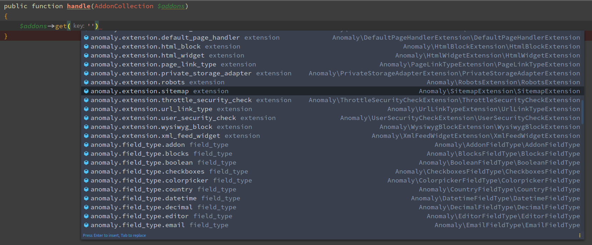

##### Views

`CTRL+click` / `CTRL+b` opens the view file.

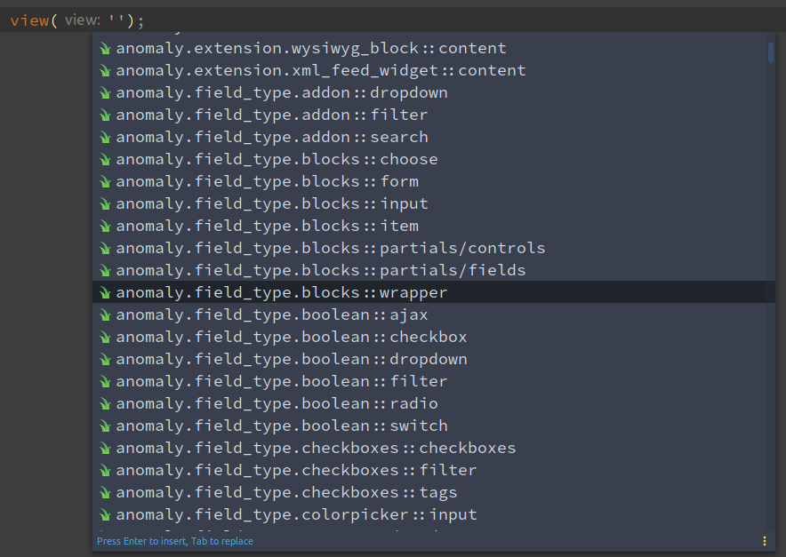


##### Config

`CTRL+click` / `CTRL+b` opens the config file.  
PyroCMS addon config files can have up to 3 locations. Opening resolves to the correct file!

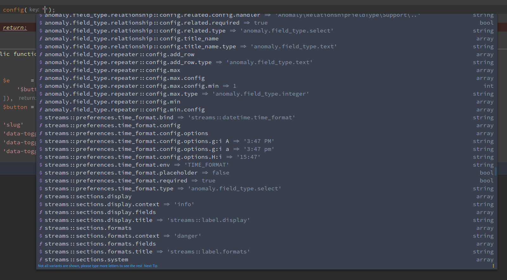


##### Streams

For `Repository` classes in all Streams

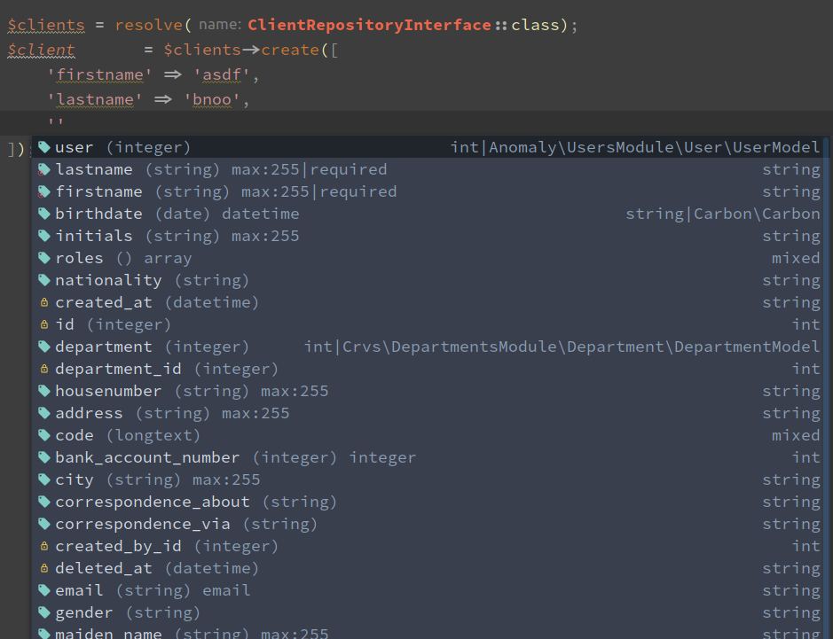
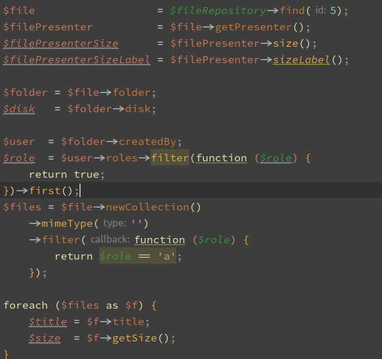
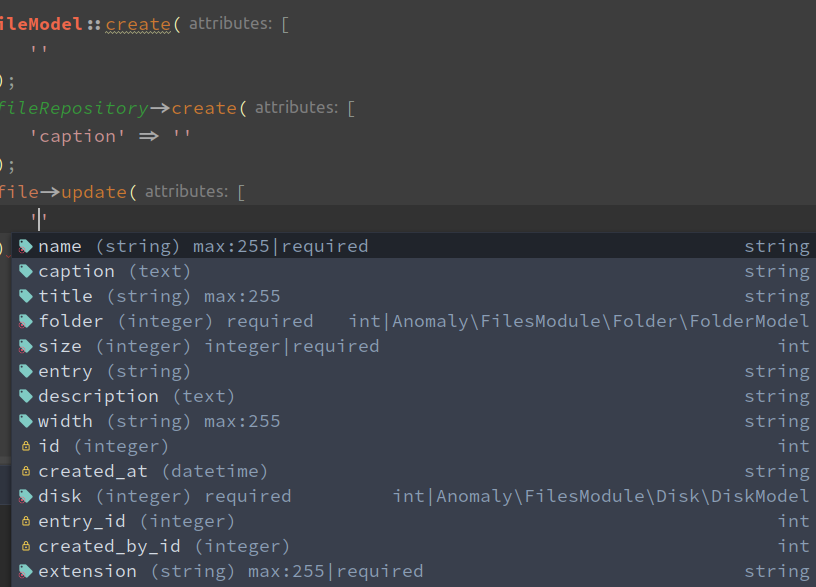


##### Model completion
screenshots todo...

##### AddonServiceProvider properties


##### Module properties
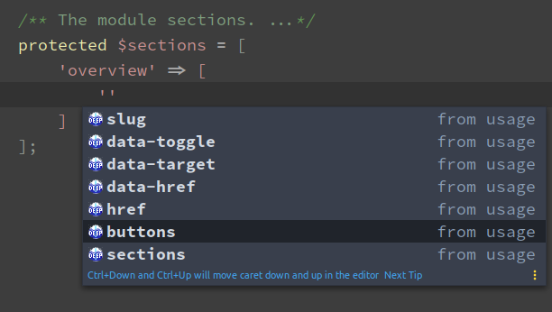
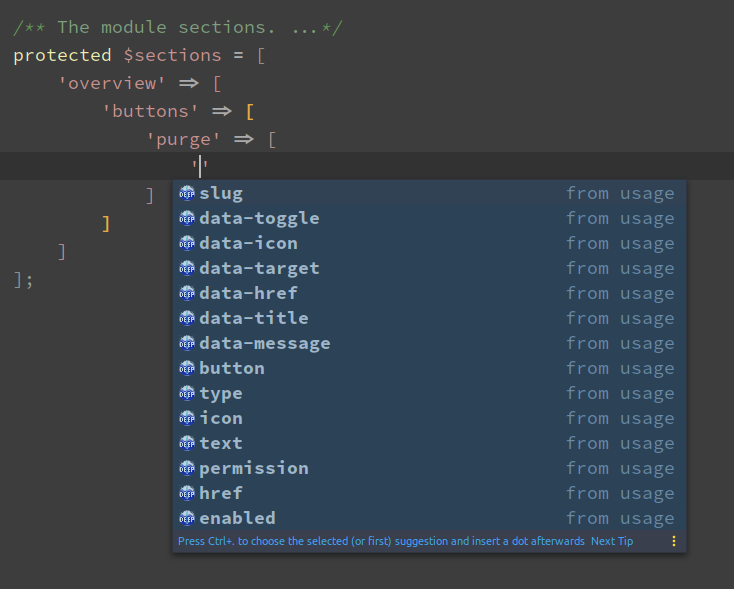

##### FormBuilder properties
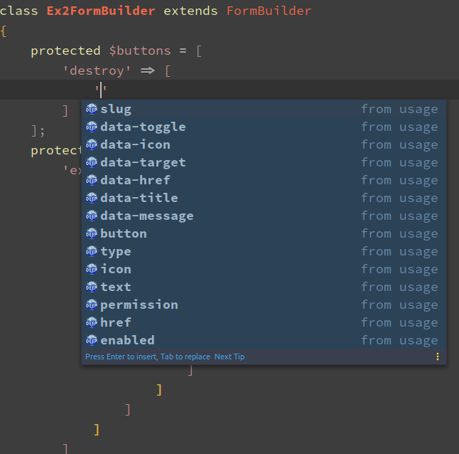
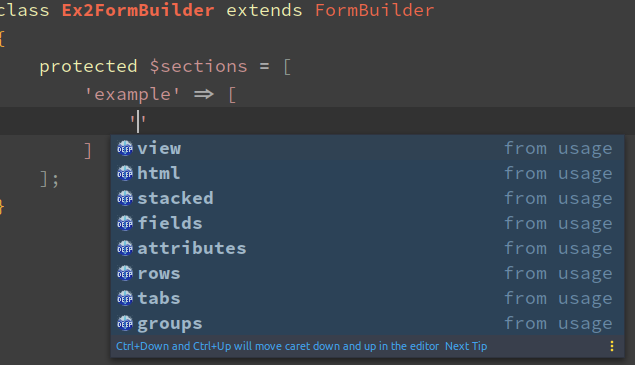
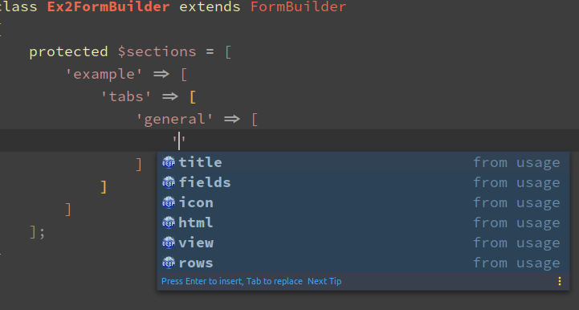
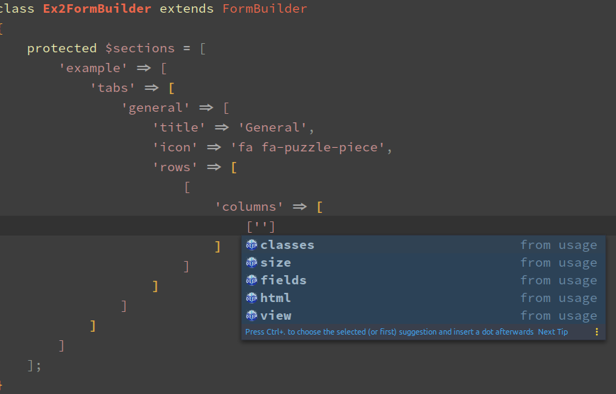

##### TableBuilder properties
- Provides the same button completion as FormBuilder
screenshots todo...

##### Twig completion (tip)
This is just a tip for when you want better code-completion in Twig files.
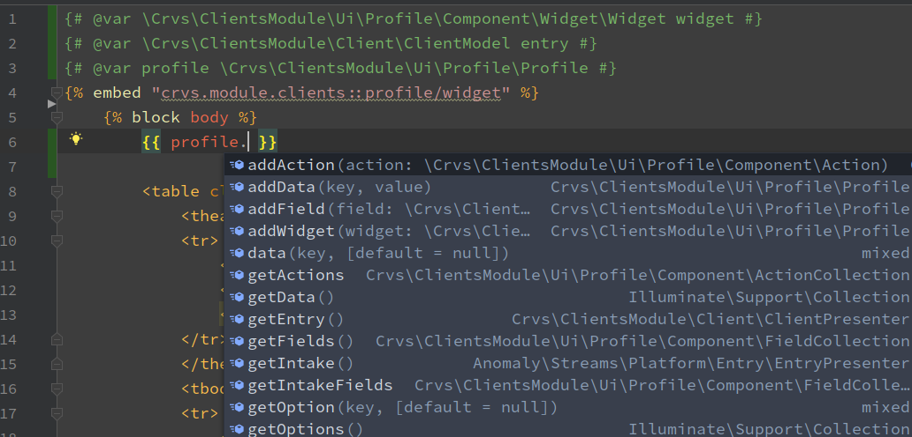


To use this: Install & Enable the symfony plugin.
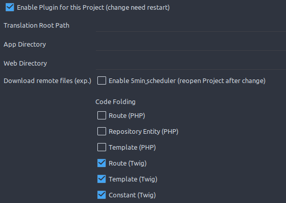


### Docblock based
Most methods and properties in stream based related classes will now resolve properly.
This is done using the same way as ide-helper:models
by generating DocBlock tags in the source files

Some examples:
```php
/**
 * Class LinkCollection
 *
 * @link http://pyrocms.com/
 * @author PyroCMS, Inc. <support@pyrocms.com>
 * @author Ryan Thompson <ryan@pyrocms.com>
 * @method \Pyro\MenusModule\Link\Contract\LinkInterface[] all()
 * @method \Pyro\MenusModule\Link\Contract\LinkInterface find($key, $default=null)
 * @method \Pyro\MenusModule\Link\Contract\LinkInterface findBy($key, $value)
 * @method \Pyro\MenusModule\Link\Contract\LinkInterface first()
 * @method \Pyro\MenusModule\Link\Contract\LinkInterface[] get($key, $default=null)
 * etc...
 */
class LinkCollection extends EntryCollection{}
```
```php
/**
 * Class LinkRepository
 *
 * @link http://pyrocms.com/
 * @author PyroCMS, Inc. <support@pyrocms.com>
 * @author Ryan Thompson <ryan@pyrocms.com>
 * @method \Pyro\MenusModule\Link\Contract\LinkInterface first($direction = 'asc')
 * @method \Pyro\MenusModule\Link\Contract\LinkInterface find($id)
 * @method \Pyro\MenusModule\Link\Contract\LinkInterface findBy($key, $value)
 * @method \Pyro\MenusModule\Link\LinkCollection|\Pyro\MenusModule\Link\Contract\LinkInterface[] findAllBy($key, $value)
 * @method \Pyro\MenusModule\Link\LinkCollection|\Pyro\MenusModule\Link\Contract\LinkInterface[] findAll(array $ids)
 * @method \Pyro\MenusModule\Link\Contract\LinkInterface create(array $attributes)
 * @method \Pyro\MenusModule\Link\Contract\LinkInterface getModel()
 * @method \Pyro\MenusModule\Link\Contract\LinkInterface newInstance(array $attributes = [])
 * etc...         
 */
class LinkRepository extends EntryRepository implements LinkRepositoryInterface{}
```
```php
/** @mixin \Pyro\MenusModule\Link\LinkRepository */
interface LinkRepositoryInterface {}
```
```php
/** @mixin \Pyro\MenusModule\Link\LinkModel */
class LinkPresenter extends EntryPresenter{}
```
```php
/** @mixin \Pyro\MenusModule\Link\LinkModel */
interface LinkInterface {}
```
```php
/** @mixin \Pyro\MenusModule\Link\LinkModel */
class LinkPresenter extends EntryPresenter{}
```


### Add Your Custom Docblock Generators
You can add your own custom docblock generation!

```php
namespace App;
class MyDocBlocks {
    public function handle(\Laradic\Generators\Doc\DocRegistry $registry){
        $registry->getClass(Guard::class)
            ->getMethod('user')
            ->ensureReturn([Authenticatable::class, UserInterface::class]);
    }
}
```

```php
namespace App\Providers;
class AppServiceProvider extends \Illuminate\Support\ServiceProvider {
    public function register(){
        $this->app->config->push('pyro.ide-helper.docblock.docblocks', \App\MyDocBlocks::class);
    }
}
```

> Check the [src/DocBlocks](src/DocBlocks) classes for examples.


### Progress

- **`DONE`** Discover possibilities / limitations of various completion providers (IntelliJ plugins, docblocks, metafiles, php helper files)
- **`ALMOST DONE`** Use the appropriate completion provider for each completion.
- **`IN PROGRESS`** Revisit all code, improve/introduce logical structure to it, cleanup mess
- **`IN PROGRESS`** Make it extendable and configurable

##### Todos

- [ ] Streams Platform
  - [x] Addons
    - [x] Module
      - [x] Properties
          - [x] Sections
          - [x] Shortcuts
      - [x] Methods
          - [x] setSections
          - [x] getSections
          - [x] addSection
          - [x] setShortcuts
          - [x] getShortcuts
          - [x] addShortcut
    - [x] AddonCollection
    - [x] ModuleCollection
    - [x] ExtensionCollection
    - [x] ThemeCollection
    - [x] PluginCollection
    - [x] FieldTypeCollection
    - [x] AddonServiceProvider
      - [x] Routes
  - [ ] UI
    - [x] Button
    - [x] ControlPanel
        - [ ] Methods
            - [ ] setButtons
            - [x] getButtons
            - [ ] addButton
            - [ ] setSections
            - [x] getSections
            - [ ] addSection
            - [ ] setNavigation
            - [x] getNavigation
            - [ ] addNavigation
    - [x] Form
        - [x] Properties
            - [x] Action
            - [x] Button
            - [x] Field
            - [x] Section
            - [x] Options
        - [x] Methods
            - [x] setActions
            - [x] getActions
            - [x] addAction
            - [x] setButtons
            - [x] getButtons
            - [x] addButton
            - [x] setSections
            - [x] getSections
            - [x] addSection
            - [x] setOption
            - [x] hasOption
            - [x] getOption
            - [x] setOptions
            - [x] getOptions
    - [ ] Table
        - [x] Row
            - [x] getButtons
            - [x] getColumns
        - [x] Column
            - [x] getEntry
        - [x] Properties
            - [x] Action
            - [x] Button
            - [x] Column
            - [x] Filter
            - [x] Header
            - [x] Row
            - [x] View
        - [x] Methods
            - [x] setActions
            - [x] getActions
            - [ ] addAction
            - [x] setButtons
            - [x] getButtons
            - [ ] addButton
            - [ ] setColumns
            - [ ] getColumns
            - [ ] addColumn
            - [ ] setFilters
            - [ ] getFilters
            - [ ] addFilter
            - [ ] setHeaders
            - [ ] getHeaders
            - [ ] addHeader
            - [ ] setRows
            - [ ] getRows
            - [ ] addRow
            - [x] setViews
            - [x] getViews
            - [x] addView
            - [x] setOption
            - [x] hasOption
            - [x] getOption
            - [x] setOptions
            - [x] getOptions
    - [ ] Tree
- [ ] Streams
  - [x] Collections
  - [ ] Criterias
  - [ ] Factories
  - [ ] Models
      - [x] Translation fields
      - [x] Fields, methods
      - [x] Presenter,Collection,Router,Builder
  - [ ] QueryBuilders
  - [x] Repositories
  - [ ] Router
  - [x] Contract
    - [x] Interface
    - [x] RepositoryInterface
- [ ] Other
    - [ ] Twig
    - [x] Views
    - [x] Config
    - [ ] ...

