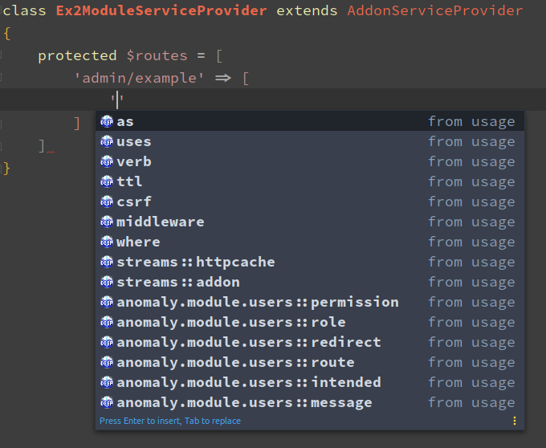

# Ide Helper for PyroCMS / Streams Platform

The purpose of this package is to provide improved code-completion for PyroCMS/Streams Platform applications and to reduce time spend
reading the documentation/other code.

Although this package has various PHPStorm specific features, it\'s still able to provide quite a few extras for other ide\'s/editors.

**This package is very much a WIP** but can already be used if wanted.

### ToC
- Todos
  - Docblocks
  - Others
- Installation
- Streams Platform & Addon related resolving & code completion
  - Addon collections
  - Views
- Docblock based
- Model Completion
- Class properties
  - AddonServiceProvider
  - Module
  - FormBuilder
  - TableBuilder
- Twig Completion


### Todos

##### Docblocks

- [ ] Streams Platform
  - [ ] Addons
    - [x] AddonCollection
    - [x] ModuleCollection
    - [x] ExtensionCollection
    - [x] ThemeCollection
    - [x] PluginCollection
    - [x] FieldTypeCollection
    - [ ] AddonServiceProvider
      - [x] Routes
  - [ ] UI
    - [x] Button
    - [ ] Form
        - [ ] Action
        - [x] Button
        - [ ] Field
        - [x] Section
    - [ ] Table
        - [ ] Action
        - [x] Button
        - [ ] Column
        - [ ] Filter
        - [ ] Header
        - [ ] Row
        - [ ] View
    - [ ] Tree
- [ ] Streams
  - [x] Collections
  - [ ] Criterias
  - [ ] Factorys
  - [ ] Models
      - [ ] Translation fields
      - [x] Fields, methods
  - [ ] QueryBuilders
  - [x] Repositories
  - [ ] Router
  - [x] Contract
    - [x] Interface
    - [x] RepositoryInterface


##### Other
- [ ] Twig
- [x] Views
- [x] Config
- [ ] ...


### Installation
> As this package is still in development, to install using the `~1.0` version constraint requires you
> to set `"minimum-stability": "dev"` and `"prefer-stable": true` in your `composer.json`

1. Install using composer
    ```sh
    composer require pyro/ide-helper:~1.0 --dev
    ```

2. Register service provider, preferably only when `APP_ENV=local`
    ```php
    \Pyro\IdeHelper\IdeHelperServiceProvider::class;
    ```

3. Run generation
    ```sh
    ide-helper:generate
    ide-helper:meta 
    ide-helper:models [--addon anomaly.module.pages]          
    ide-helper:streams
    idea:completion
    idea:meta
    ```

### Streams Platform & Addon related resolving & code completion

> These feature requires:
> - PHPStorm/IntelliJ IDEA **^2019**. Ensure you have at least `2019.1.1`
> - PHPStorm/IntelliJ plugin **PHP Toolbox**

##### Addon collections


For AddonCollection, ModuleCollection, ThemeCollection etc.  
`CTRL+click` / `CTRL+b` opens the addon class file.


##### Views

`CTRL+click` / `CTRL+b` opens the view file.


##### Config

`CTRL+click` / `CTRL+b` opens the config file.  
PyroCMS addon config files can have up to 3 locations. Opening resolves to the correct file!


##### Streams Repositories

For `Repository` classes in all Streams


### Docblock based
Most methods and properties in stream based related classes will now resolve properly.
This is done using the same way as ide-helper:models
by generating DocBlock tags in the source files or in a separate file

Some examples:
```php
/**
 * Class LinkCollection
 *
 * @link http://pyrocms.com/
 * @author PyroCMS, Inc. <support@pyrocms.com>
 * @author Ryan Thompson <ryan@pyrocms.com>
 * @method \Pyro\MenusModule\Link\Contract\LinkInterface[] all()
 * @method \Pyro\MenusModule\Link\Contract\LinkInterface find($key, $default=null)
 * @method \Pyro\MenusModule\Link\Contract\LinkInterface findBy($key, $value)
 * @method \Pyro\MenusModule\Link\Contract\LinkInterface first()
 * @method \Pyro\MenusModule\Link\Contract\LinkInterface[] get($key, $default=null)
 * etc...
 */
class LinkCollection extends EntryCollection{}
```
```php
/**
 * Class LinkRepository
 *
 * @link http://pyrocms.com/
 * @author PyroCMS, Inc. <support@pyrocms.com>
 * @author Ryan Thompson <ryan@pyrocms.com>
 * @method \Pyro\MenusModule\Link\Contract\LinkInterface first($direction = 'asc')
 * @method \Pyro\MenusModule\Link\Contract\LinkInterface find($id)
 * @method \Pyro\MenusModule\Link\Contract\LinkInterface findBy($key, $value)
 * @method \Pyro\MenusModule\Link\LinkCollection|\Pyro\MenusModule\Link\Contract\LinkInterface[] findAllBy($key, $value)
 * @method \Pyro\MenusModule\Link\LinkCollection|\Pyro\MenusModule\Link\Contract\LinkInterface[] findAll(array $ids)
 * @method \Pyro\MenusModule\Link\Contract\LinkInterface create(array $attributes)
 * @method \Pyro\MenusModule\Link\Contract\LinkInterface getModel()
 * @method \Pyro\MenusModule\Link\Contract\LinkInterface newInstance(array $attributes = [])
 * etc...         
 */
class LinkRepository extends EntryRepository implements LinkRepositoryInterface{}
```
```php
/*
 * ...
 * @mixin \Pyro\MenusModule\Link\LinkModel
 */
class LinkPresenter extends EntryPresenter{}
```
```php
/*
 * ...
 * @mixin \Pyro\MenusModule\Link\LinkModel
 */
interface LinkInterface {}
```
```php
/*
 * ...
 * @mixin \Pyro\MenusModule\Link\LinkModel
 */
class LinkPresenter extends EntryPresenter{}
```

### Model completion
todo...

### Class properties
The screenshots should make it all clear.

> This feature requires PHPStorm/IntelliJ IDEA with the `deep-assoc-completion` plugin installed

#### AddonServiceProvider properties


#### Module properties


#### FormBuilder properties


#### TableBuilder properties
- Provides the same button completion as FormBuilder

### Twig completion
todo...